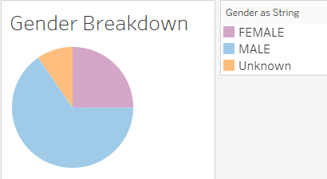

# NYC Citibike Bikesharing

## Overview

### Purpose
Our objective for creating this Tabeau Viz was to provide data and visualizations to persuade investors in Des Moines that bikesharing has been successful in NYC and can be adapted for their own city. Specifically we were asked to show the length of time that bikes are checked out for all riders and genders, the number of trips for all riders and genders for each hour of each day of the week and the number of bike trips for each type of user and gender for each day of the week.

## Results
### [Link to Tableau Story](https://public.tableau.com/app/profile/matthew.reid/viz/NYCCitibikeChallenge_16417577644140/Story1?publish=yes "Link to Tableau Story")

Above is a link to our "Story" in Tableau that visualizes the objectives that we were tasked with

### Gender Breakdown and User Type

With this visualization, we can see that males use the bike sharing two thirds of the time with females using the bikesharing at a rate of 25%. The unknown category is quite significant at 225,000 occurances. This may be looked at in the future to see if we can parse or extract an of this data to draw a clearer picure.

We can see in this visualization that the vast majority of bikes are checked out by subscribers at a significant rate of 87% of the time. This shows us that subscribers are repeatedly using this service at a greater rate than a regular customer.

### Length of Time Bikes are Checked Out

This visualization depicts the check out times of bikes for all users. As shown above, the most popular duration is 5 minutes with a total of nearly 147,000 occurances. The duraction decreases ecponentially after 5 minutes with around 21,000 bike check outs lasting 30 minutes and less than a thousand at the one hour mark.

Like the previous visualization, the breakdown by gender shows a similar story with the peak usage duration between genders varying only slightly. Male check out usage peaks at 5 minutes, Females at 6 minutes and Unkown at 11 minutes. As made evident by our first image, this visualization shows the drastic gap between the usage of bikes broken down by gender

### Trips by Hour and Weekday

We can see in this image that there peak hours during the week that fall in line with rush hour. 7am through 10am and 5pm through 7pm are the busiest times Monday through Friday. On weekends, the usage is more spred out with most rentals happening between 9am and 9pm.

As with previous visualizations, we can see the parody of peak hours and the skewed usage by males. The one suprising thing we can gather is that the unknown gender doesn't follow the typical usage during peak hours during the week but still falls in line with what we would expect during the weekend.

In this final visualization, we can gather that subscribers are more likely to use the bikeshare during the week as opposed to customers, who tend to have more usage during the weekend. We can also see that there are more unknown gender customers using the service than that of the same regarding the subscribers, but to an unkown degree

## Overview
These visualizations should be key in helping our Des Moines investors identify what works, what can be adapted and what may need to be improved. Specifically, we can see that there may be more marketing can be down to decrease the gender gap. If we can increase the usage by our female demographic, this could help the business be more successful in a smaller market. We may want to create a visualization that compares start and ending locations by gender to see if there are areas of the city that go against the trends we see in the gender disparity.

We also noticed that non-subscribers are more likely to use the service during the weekend as opposed to during the week. This suggests that the customers are more likely to be tourists. We also saw a trend that suggests there is a higher rate of unknown trips among the customer group than the subscriber group. It would be interesting to see the gender breakdown among subscribers and customers. We have reason to believe that there are more customers with an unknown gender than subscribers. We may have to look at the app and data collection to see if we can improve on identifying the gender of regualr customers to help gather additional demographic data.

